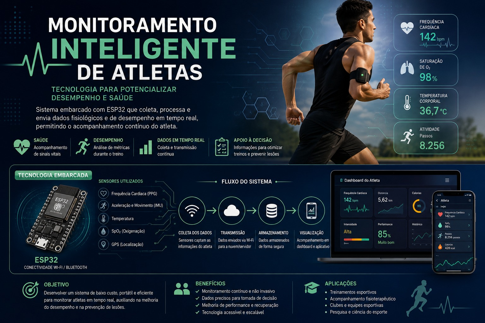

# ATLETA — Projeto Integrador 6 / N1

Monitoramento de atividade com **M5StickC Plus2 → MQTT → EMQX → MySQL → painel Windows**.

[Abrir a GitPage do Atleta](https://Babi-Portella.github.io/atleta/).



## Entregáveis da primeira N1

| Requisito | Arquivo |
| --- | --- |
| GitPage: Home, Plataforma, Dispositivos e Aplicativo | [site/index.html](site/index.html) |
| Firmware 2.1.7 conectado à plataforma própria | [main.cpp](laboratorio/firmware/src/main.cpp), [activity.h](laboratorio/firmware/src/activity.h), [guia](laboratorio/README.md) |
| Diagrama completo | [SVG](site/assets/diagrama-projeto-v1.svg), [PNG](site/assets/diagrama-projeto-v1.png), [fonte](docs/DIAGRAMA.md) |
| Banner atualizado | [PNG](site/assets/banner-atleta-v1.png) |
| Circuito eletrônico | [SVG](site/assets/circuito-v1.svg), [PNG](site/assets/circuito-v1.png), [pinagem](docs/CIRCUITO.md) |
| Aplicativo da primeira versão | [Painel Windows](laboratorio/entrega/PainelIP.exe) e [código](laboratorio/painel/app.py) |

## Equipe

- **Babi Portella** — [Babi-Portella](https://github.com/Babi-Portella).
- **Emilio467** — [Emilio467](https://github.com/Emilio467).
- **jvBaracho** — [jvBaracho](https://github.com/jvBaracho).

As contribuições individuais serão registradas quando confirmadas; a hospedagem
na conta da Babi não atribui a ela autoria exclusiva do projeto.

## Abrir no Windows

1. Extraia o pacote completo em uma pasta. Instale e inicie Docker Desktop com containers Linux.
2. Abra **ABRIR PAINEL.exe**. Python não é necessário para usar o executável.
3. Marque **Permitir conexão do M5 pela rede** e inicie o laboratório.
4. Configure a rede Wi-Fi de 2,4 GHz e o servidor no M5 usando o botão de configuração por USB.
5. Aguarde **Conexão confirmada** e consulte **Ver dados do atleta**.

Cada instalação nova cria suas credenciais e banco. Senhas, histórico local e
backups privados não integram o repositório. O primeiro início requer internet.

## Compilar o M5

Requer Python e internet para instalar as dependências. Execute na raiz:

```powershell
python -m venv .venv-lab
.\.venv-lab\Scripts\python.exe -m pip install -r laboratorio\requirements.txt
.\.venv-lab\Scripts\python.exe laboratorio\tools\release.py --firmware-only
```

Para gravar, substitua COM3 pela porta do relógio:

```powershell
.\.venv-lab\Scripts\python.exe laboratorio\tools\flash.py --port COM3
```

O M5 dos testes já usa 2.1.7. Trocar o servidor exige configurar a rede por USB.

## GitHub Pages

O workflow [.github/workflows/pages.yml](.github/workflows/pages.yml) publica
somente `site/`. Em **Settings → Pages**, selecione **GitHub Actions**.
EMQX, MySQL e o painel executam no PC servidor; a GitPage apresenta o projeto.

Prévia local:

```powershell
python -m http.server 8765 --bind 127.0.0.1 --directory site
```

## Validação e limites

Em 02/10/2026, o M5 2.1.7 enviou **12.113 amostras por MQTT/MySQL** na captura.
Uma caminhada de 20 passos curtos registrou **17**; colocar e manusear o relógio
não acrescentou passos nesse ensaio. É uma medição, sem garantia de precisão geral.
Veja [as evidências](laboratorio/evidencias/contador-passos-2.1.7.json).

Distância e calorias são estimativas dependentes do perfil. BPM, SpO₂,
temperatura corporal, GPS e aplicativo móvel ilustrados no banner são expansões
futuras. O esquema do circuito resume os componentes internos utilizados no M5.
O código original FastAPI está preservado e sua integração à telemetria é futura.
