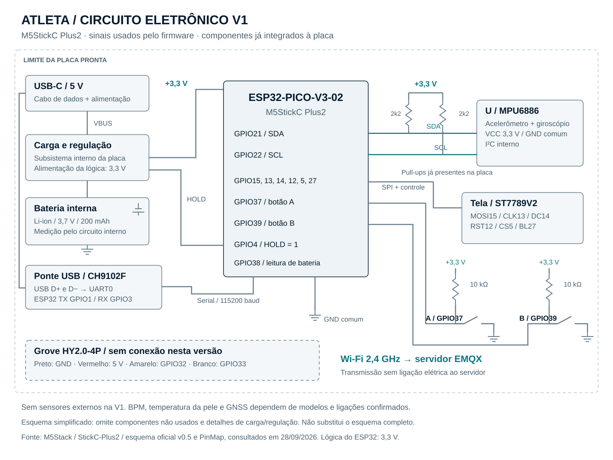

# Circuito eletrônico — M5StickC Plus2

Este desenho é um **esquema simplificado do circuito integrado à placa**, com os
sinais utilizados pelo projeto. Não é uma PCB nova nem um desenho completo do fabricante.
A primeira versão funciona com a placa pronta e cabo USB-C de dados, sem sensores externos.

## Materiais da primeira versão

| Item | Quantidade | Função |
| --- | --- | --- |
| M5StickC Plus2 | 1 | ESP32, IMU, tela, botões e bateria integrados |
| Pulseira compatível | 1 | Fixação para os ensaios de atividade |
| Cabo USB-C de dados | 1 | Alimentação, programação e configuração |
| Computador com Docker | 1 | EMQX, MySQL e painel |
| Rede Wi-Fi 2,4 GHz | 1 | Comunicação da placa com o servidor |

## Sinais internos relevantes

| Circuito / sinal | GPIO do ESP32 | Observação |
| --- | --- | --- |
| MPU6886 / SDA | 21 | Barramento I²C interno, compartilhado com o RTC |
| MPU6886 / SCL | 22 | Pull-ups de 2,2 kΩ já presentes na placa |
| Tela / MOSI, CLK | 15, 13 | Interface SPI interna |
| Tela / DC, RESET, CS, BL | 14, 12, 5, 27 | Controle da tela integrado |
| Botão A, B | 37, 39 | Entradas com resistores internos à placa; botão leva o sinal ao GND |
| HOLD | 4 | Mantido em nível alto pelo firmware para sustentar a alimentação |
| Detecção de bateria | 38 | Circuito de leitura já integrado; acesso via M5Unified |
| UART da ponte USB CH9102F | TX 1 / RX 3 | UART0 da placa; serial a 115200 baud |
| Grove HY2.0-4P | 32, 33 | I/O de expansão, separado do I²C interno |

## Alimentação e montagem

Alimentação pela porta USB-C (5 V) ou bateria interna de 3,7 V / 200 mAh.
O circuito interno de carga e regulação entrega a alimentação da lógica;
o esquema resume esse subsistema sem substituir os detalhes do fabricante.
As entradas e saídas do ESP32 trabalham com lógica de 3,3 V.
O conector Grove oferece GND (preto), 5 V (vermelho), GPIO32 (amarelo)
e GPIO33 (branco). A presença de 5 V no conector não torna seus GPIOs tolerantes a 5 V.
Não são necessárias ligações ao Grove nesta entrega.

O HW-827 citado no contexto anterior não tem pinagem/alimentação confirmadas neste
projeto. Por isso, o circuito não prescreve sua ligação. BPM, temperatura da pele
e GNSS devem receber esquemas próprios quando os módulos forem identificados.

## Fontes verificadas em 28/09/2026

- [Pinagem, alimentação e operação oficiais do StickC-Plus2](https://docs.m5stack.com/en/core/M5StickC%20PLUS2).
- [Esquema oficial M5StickC Plus2 v0.5, três folhas](https://m5stack-doc.oss-cn-shenzhen.aliyuncs.com/512/Sch_M5StickC_Plus2_v0.5.pdf).

O desenho local destaca apenas o caminho necessário ao firmware atual. Para reparo,
layout de PCB e valores dos componentes omitidos, use o esquema oficial.
