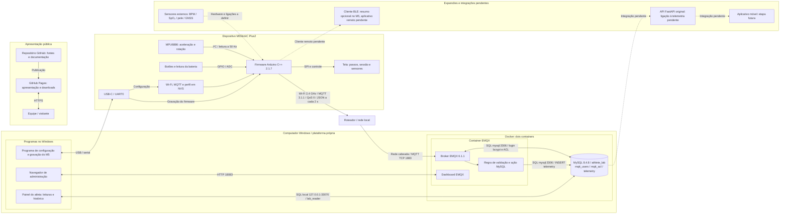
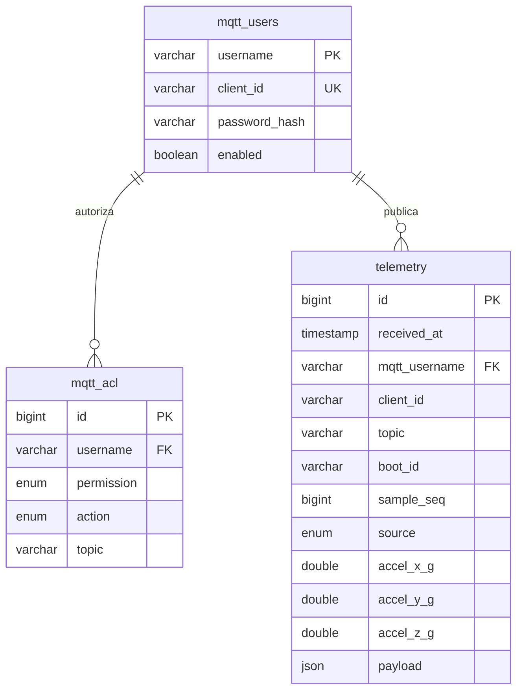

# Diagrama completo — primeira versão revisada

O M5 publica pela rede local; o EMQX recebe, valida e envia a telemetria para o MySQL.
Os dois serviços rodam em containers Docker no computador servidor. O painel do atleta,
o navegador de administração e o programa de configuração USB rodam no Windows,
fora dos containers. Um único MySQL contém as tabelas `mqtt_users`, `mqtt_acl` e `telemetry`.

A GitPage é a apresentação estática do projeto, com documentação e downloads.
A API FastAPI do código original está separada do laboratório; sua ligação à telemetria
ainda é uma etapa futura. O cliente BLE, o aplicativo móvel e os sensores externos
também ficam identificados como expansões ou integrações pendentes.

Na imagem, setas verdes representam o fluxo de dados implementado e setas lilás
representam configuração ou administração. As caixas tracejadas mostram etapas futuras.
A publicação MQTT indicada corresponde ao modo normal; a captura diagnóstica de IMU
usa mensagens adicionais quando ativada.

## Contrato de dados

Tópico de produção: `atletas/m5-atleta-01/telemetria`.
Campos obrigatórios da regra: `schema_version=1`, `source=device` ou `test`,
`boot_id`, `sample_seq` inteiro não negativo e aceleração X/Y/Z numérica.
O broker fornece a identidade autenticada, o Client ID e o tópico ao banco.
A chave única é `(mqtt_username, boot_id, sample_seq)`.
`received_at` é a recepção no banco; `uptime_ms` é o tempo desde o boot da placa.

## Modelo de dados

Portas no perfil servidor novo: MQTT `1883`, Dashboard `18083` e MySQL
`127.0.0.1:33070`; entre containers, MySQL `mysql:3306`.
O endereço real é configurável e não é fixado nos diagramas.
Referência: [integração MySQL do EMQX](https://docs.emqx.com/en/emqx/latest/develop/data-integration/data-bridge-mysql.html).
