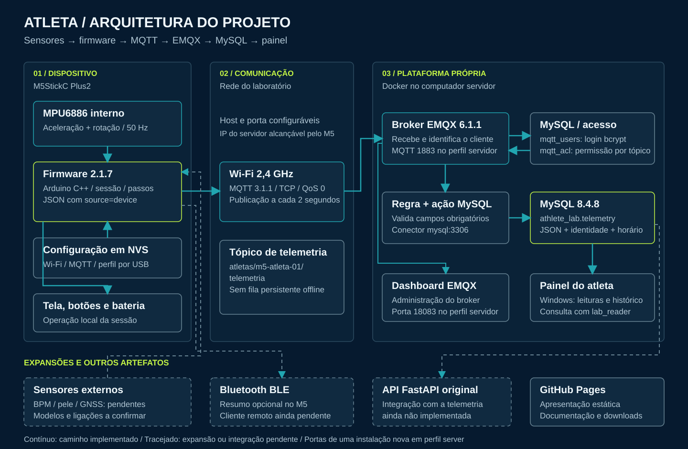
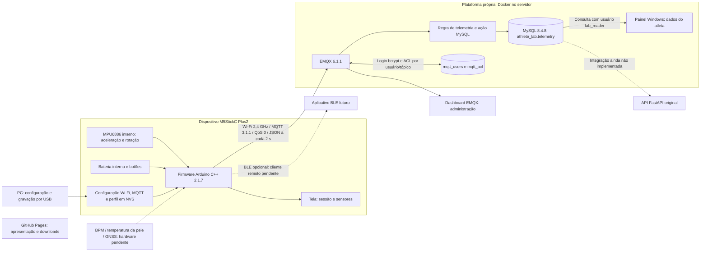
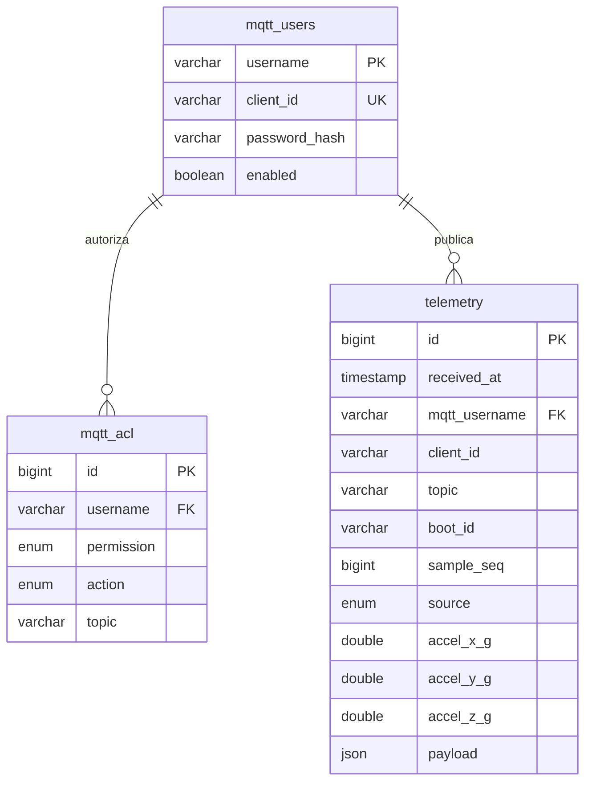

# Diagrama completo — primeira versão

O caminho implementado termina no painel Windows do atleta. A GitPage é a apresentação
estática do projeto e não acessa o banco nem o broker. A API FastAPI do código original
está separada do laboratório; a ligação da telemetria à API ainda é uma etapa futura.

## Contrato de dados

Tópico de produção: `atletas/m5-atleta-01/telemetria`.
Campos obrigatórios da regra: `schema_version=1`, `source=device` ou `test`,
`boot_id`, `sample_seq` inteiro não negativo e aceleração X/Y/Z numérica.
O broker fornece a identidade autenticada, o Client ID e o tópico ao banco.
A chave única é `(mqtt_username, boot_id, sample_seq)`.
`received_at` é a recepção no banco; `uptime_ms` é o tempo desde o boot da placa.

## Modelo de dados

Portas no perfil servidor novo: MQTT `1883`, Dashboard `18083` e MySQL
`127.0.0.1:33070`; entre containers, MySQL `mysql:3306`.
O endereço real é configurável e não é fixado nos diagramas.
Referência: [integração MySQL do EMQX](https://docs.emqx.com/en/emqx/latest/develop/data-integration/data-bridge-mysql.html).
