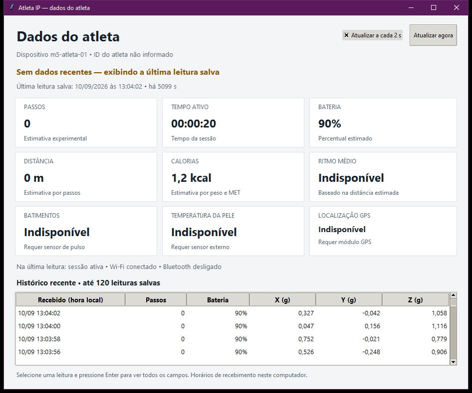

# Ver os dados do atleta — Atleta IP 1.3.1

1. Abra [PainelIP.exe](../entrega/PainelIP.exe) no computador que executa o laboratório.
2. Se o laboratório estiver parado, clique em **Iniciar laboratório e abrir Dashboard**.
3. Clique em **Ver dados do atleta** na janela principal do programa.



## O que aparece

- Passos e tempo ativo da sessão.
- Percentual estimado de bateria.
- Distância, calorias e ritmo estimados, quando o perfil tem os parâmetros necessários.
- BPM, temperatura da pele e GPS, quando os respectivos sensores estiverem implementados/configurados.
- Estado da sessão, Wi-Fi e Bluetooth na última leitura.
- Horário da última gravação e histórico das **120 leituras físicas mais recentes**.
- Aceleração X/Y/Z no histórico, em g. Selecione uma linha e pressione Enter
  (ou dê dois cliques) para consultar todos os campos daquela leitura.

Sem sensor ou parâmetro de perfil, o campo mostra **Indisponível**. Zero é mantido
quando realmente foi enviado pelo firmware, como zero passos com a placa parada.
Distância e calorias são estimativas, e o contador de passos ainda não foi calibrado.
Na tela Windows, a distância aparece em **metros abaixo de 1.000 m** e em
**quilômetros a partir de 1.000 m**: por exemplo, `0,3 m`, `250 m`, `999,9 m`
e `1,000 km`. A unidade do campo armazenado `distancia_km` continua sendo km.

## Atualização e disponibilidade

As consultas acontecem a cada dois segundos. Desmarque **Atualizar a cada 2 s**
para pausar a consulta; isso não pausa a sessão na placa nem o servidor.
**Atualizar agora** ou F5 consultam os valores novamente.

O indicador **Recebendo dados** significa que a última leitura foi salva há no
máximo dez segundos. Após esse prazo, a janela informa **Sem dados recentes** e
preserva os valores, identificados pelo horário. Isso não determina sozinho se
a causa está no Wi-Fi, no MQTT, na placa ou na regra de gravação.

Se a consulta ao banco falhar, a janela avisa que os valores anteriores podem
estar desatualizados. Se ainda não houver amostras, orienta iniciar o laboratório
e conectar o M5. Leituras sintéticas dos testes de servidor não aparecem nesta tela.

## Dispositivo e identidade

Esta versão acompanha **m5-atleta-01**. O ID do atleta aparece se foi preenchido
no perfil do M5; quando ausente, a janela informa **ID do atleta não informado**.
Ela não associa automaticamente a pulseira a uma pessoa cadastrada na API original.
O histórico recente pode conter várias sessões; os cartões sempre mostram a
última leitura, e os detalhes da linha incluem o identificador da sessão.

## Execução e acesso

É uma janela do próprio programa Windows, acessada por botão. O console EMQX
continua acessível em **Abrir Dashboard** para administrar clientes e regras.
A consulta usa a conta `lab_reader` e somente SELECT em `athlete_lab.telemetry`,
filtrando a identidade MQTT do M5 e `source=device`. Não modifica os dados.

O MySQL permanece acessível só por localhost. Execute esta janela no PC do
servidor usando a pasta original do laboratório, que contém suas credenciais
privadas. O executável portátil não inclui senhas. A tela dispensa conexão USB
com a placa; os dados chegam ao banco pelo Wi-Fi/MQTT.

Para abrir diretamente a tela de dados, também é possível usar:

```powershell
.\PainelIP.exe --dados-atleta
# Caso a pasta do laboratório esteja em outro local:
.\PainelIP.exe --dados-atleta --pasta "C:\caminho\laboratorio"
```

## Validação

O relatório [validacao-dados-atleta.json](../evidencias/validacao-dados-atleta.json)
registra a consulta real e a comparação dos cartões com os payloads armazenados,
além dos testes de atualização, dados antigos, falha e histórico vazio. Os
[testes automatizados](../evidencias/testes-painel-130.log) cobrem os filtros,
permissão de leitura, campos indisponíveis e formatação. O
[teste do executável](../evidencias/validacao-dados-atleta-exe.json) registra seu SHA-256.
