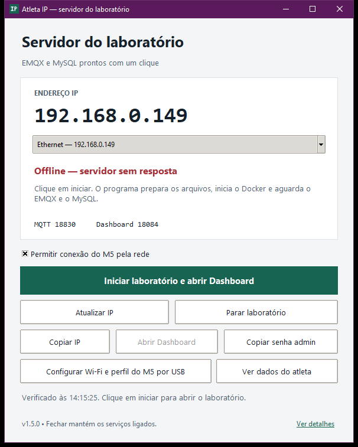

# Atleta IP 1.5.0 — laboratório e dados do atleta

Abra [`PainelIP.exe`](../entrega/PainelIP.exe) e clique em **Iniciar laboratório e
abrir Dashboard**. O programa prepara os arquivos, inicia o Docker Desktop
instalado, sobe EMQX e MySQL, aguarda a inicialização e abre o painel no navegador.



Para acompanhar o dispositivo, clique em **Ver dados do atleta**. A nova janela
mostra os valores salvos no MySQL, atualiza a cada dois segundos e avisa quando
não há dados recentes. Veja [as instruções e a tela](DADOS_ATLETA.md).

## Primeiro uso

A versão 1.5.0 preenche o nome da rede a partir da conexão Wi-Fi ativa do
Windows ao abrir a configuração do M5. A senha salva no projeto é reutilizada
apenas para o mesmo nome exato de rede; em outra rede, o campo é limpo para
preenchimento local. O programa não lê senhas armazenadas pelo Windows.
Se não houver Wi-Fi ativo, houver mais de uma rede ativa ou a consulta for
negada, a tela explica a situação e mantém o preenchimento manual.

Após enviar por USB, o painel consulta STATUS/INVENTORY e observa a telemetria
da placa. Só confirma dados ao vivo quando uma amostra com o mesmo boot_id e
sample_seq aparece no MySQL e tem até 10 segundos de idade. O histórico
restaurado não serve como confirmação. O resultado sem senhas é registrado
em runtime/diagnostico-conexao-m5.json e em Ver detalhes.

A detecção usa a API documentada do Windows
[GetConnectedSsid](https://learn.microsoft.com/en-us/uwp/api/windows.networking.connectivity.wlanconnectionprofiledetails.getconnectedssid).

1. Abra o executável no computador que será o servidor.
2. Para conectar o M5 pela rede, marque **Permitir conexão do M5 pela rede**.
3. Clique em **Iniciar laboratório e abrir Dashboard** e acompanhe as quatro etapas.
4. Quando o navegador abrir, use o usuário **admin**. Clique em **Copiar senha admin**
   e cole a senha na tela de login.

O Docker Desktop precisa estar instalado e com a primeira configuração concluída.
Se estiver ausente, o botão **Instalar Docker** abre as instruções oficiais.
Permissões do Windows, requisitos do WSL e eventual reinício pertencem à instalação
inicial do Docker. Depois dela, os botões dispensam Python instalado e PowerShell.

### Se aparecer “Não foi possível concluir”

Abra o Docker Desktop no computador em que ocorreu a falha, conclua a configuração
inicial e confira se o mecanismo Linux está funcionando. Depois tente iniciar pelo
painel novamente. Consulte **Ver detalhes** para obter a causa específica em
`runtime/painel-acao.log`. O registro oculta as credenciais geradas e as senhas
cadastradas nos arquivos de configuração. Não compartilhe a pasta `runtime/` inteira.

A versão **1.1.1** corrige a descoberta da instalação do Docker apenas para o usuário
em `%LOCALAPPDATA%\Programs\DockerDesktop`, além das instalações antigas. O cliente
e seus auxiliares funcionam mesmo se o painel herdar o PATH anterior à instalação.
Falhas do mecanismo Linux e exceções inesperadas agora ficam registradas nos detalhes;
erros de rede, porta ocupada e Docker ainda não pronto têm títulos específicos.

Para atualizar uma instalação existente, feche o painel e substitua apenas
`PainelIP.exe` na mesma pasta. Preserve configurações e dados existentes.

Essas correções foram verificadas localmente. O registro relatado pelo usuário
mostrou consultas ao Docker excedendo o prazo antes de iniciar EMQX/MySQL. Isso
localiza a etapa que falha, mas não identifica se a causa é WSL, configuração
pendente ou travamento do Docker Desktop naquele computador.

Na primeira utilização, o download das imagens pode demorar e precisa de Internet.
Quando já estiverem presentes, o Docker reutiliza as imagens locais.

## O que cada botão faz

| Controle | Comportamento |
| --- | --- |
| Iniciar laboratório e abrir Dashboard | Verifica/inicia Docker Desktop, prepara a configuração, inicia a stack dedicada, aguarda os serviços, salva o IP e abre o painel. |
| Parar laboratório | Para somente EMQX e MySQL de `atleta-lab`, sem remover containers ou volumes. |
| Atualizar IP | Detecta/verifica o endereço e salva IP/porta, sem iniciar serviços. |
| Copiar IP | Copia o endereço exibido. |
| Abrir Dashboard | Abre um Dashboard já identificado pela verificação. |
| Copiar senha admin | Copia a senha gerada desta instalação após o clique do usuário. A senha não aparece na tela nem no registro. |
| Configurar Wi-Fi e perfil do M5 por USB | Abre o formulário de rede e perfil opcional; salva localmente e envia a configuração para a placa pelo botão Enviar. Requer o firmware do laboratório já gravado. |
| Ver dados do atleta | Mostra a última leitura física do M5, cartões de atividade e histórico das 120 leituras mais recentes no MySQL local. |
| Ver detalhes | Abre `runtime/painel-acao.log`, com as credenciais geradas ocultadas. |
| F5 | Verifica novamente sem salvar a configuração. |

Abrir a janela faz somente uma consulta. Iniciar depende do botão. Fechar a
janela mantém os serviços ligados; use **Parar laboratório** para encerrá-los.
O painel mantém o Docker Desktop disponível para outros projetos.

## Instalação nova e preservação dos dados

O pacote **Atleta-Migracao-PRIVADO.zip** inclui o perfil, a configuração Wi-Fi e
um snapshot consistente da tabela de telemetria. Na versão 1.4.0, **Iniciar
laboratório** restaura esse histórico em uma transação e confere integralmente
IDs, horários e payloads. Repetir a operação não duplica registros. Dados
conflitantes interrompem a restauração e nenhuma linha existente é substituída.
As credenciais do servidor são geradas no destino e precisam ser enviadas ao M5
por USB. Consulte [o guia para outro PC](PRIMEIRO_USO_OUTRO_PC.txt).

O pacote público não inclui esse snapshot nem a configuração Wi-Fi privada.

O executável inclui os modelos de Compose e SQL e o gerador de configuração.
Sozinho, prepara uma subpasta `laboratorio/` ao lado do EXE. Dentro do kit, encontra
a pasta `laboratorio/` existente. Também é possível indicar uma pasta explícita:

```powershell
.\PainelIP.exe --pasta "C:\caminho\laboratorio"
```

Na primeira preparação são geradas senhas próprias. Nas seguintes, elas são
preservadas. O SQL inicial não é reaplicado ao banco existente. Os dados ficam
nos volumes Docker do projeto `atleta-lab`.

Se já existirem volumes desse projeto e a pasta atual não possuir a configuração
completa, o painel interrompe a preparação e orienta usar a pasta original.
Isso evita gerar credenciais incompatíveis com um banco existente. Preserve a
pasta `runtime/` ao mover uma instalação; ela é privada e não entra no ZIP público.

A ação de parar usa `docker compose stop` somente nos serviços `emqx` e `mysql`.
O painel não usa comandos para remover volumes. Docker Desktop pode retomar
outros serviços conforme as configurações dele; o painel não os administra.

## IP, portas e acesso pelo M5

O programa detecta o IP do computador onde está aberto. No laboratório, execute-o
no próprio servidor. Ele prioriza Ethernet/Wi-Fi com gateway sobre interfaces
virtuais e permite selecionar outra conexão. Não há varredura de sub-redes.

| Nova instalação | MQTT | Dashboard | Acesso |
| --- | --- | --- | --- |
| Opção de rede marcada | 1883 | 18083 | IP da máquina / rede local |
| Opção desmarcada | 18830 | 18084 | Somente localhost |

Em uma instalação existente, a opção muda o endereço de escuta e o perfil,
**preservando as portas já cadastradas**. Por exemplo, uma instalação criada
localmente pode receber o M5 pelo IP da máquina na porta 18830 após habilitar a
rede. O painel sempre mostra a porta efetiva. MySQL continua em localhost:33070.

O firewall do Windows não é modificado automaticamente. “Online” comprova a
resposta a partir deste PC; a conexão a partir do M5 depende da rede e do firewall.

O botão de iniciar gerencia uma instância dedicada deste kit. Se o professor já
possuir um broker compartilhado, utilize [o guia do Dashboard](DASHBOARD.md).
Portas ocupadas geram um erro; o programa não substitui o outro serviço.

Após detectar o endereço, o programa atualiza somente `mqtt_host` e `mqtt_port`
em `config.local.json` e, se existir, `runtime/device-config.json`. Wi-Fi, senhas,
identidade e demais campos são preservados. `endereco-servidor.json` contém
endereço, portas e estado, sem credenciais.

Para o M5 passar a usar o novo endereço, clique em **Configurar Wi-Fi e perfil
do M5 por USB** e depois em **Enviar ao M5 por USB**. A janela encontra a porta
CH9102 quando há um dispositivo correspondente, aceita vírgula nos números do
perfil e mantém a senha mascarada. A resposta `CONFIG_OK` confirma o salvamento
na placa; a conexão e a persistência são etapas posteriores. Consulte o
[guia do M5](FIRMWARE_M5.md). O painel configura uma placa já gravada e não grava firmware.

## Estados e diagnóstico

| Estado | Significado |
| --- | --- |
| Online — EMQX respondendo | MQTT e `/status` do EMQX responderam pelo IPv4 selecionado. |
| Pronto para usar neste PC | MQTT respondeu por localhost; o Dashboard local pode ser aberto. |
| MQTT online • Dashboard indisponível | Um broker MQTT respondeu, mas o painel não foi identificado. |
| Offline — servidor sem resposta | Não houve resposta MQTT nas portas verificadas. |
| Sem IP de rede | Não há IPv4 de rede utilizável; o Dashboard ainda pode funcionar em localhost. |

O estado não mede a Internet, a leitura física, o login do M5 ou a persistência
MySQL. A inicialização também verifica os healthchecks dos dois containers.

O teste MQTT usa uma identidade temporária sem publicar nem assinar. A recusa de
autenticação também comprova resposta do broker e pode aparecer no log. O teste
de disponibilidade do Dashboard não envia senha.

Diagnóstico sem abrir a janela ou salvar configuração:

```powershell
.\PainelIP.exe --diagnostico "C:\pasta\diagnostico.json"
```

## Código e compilação

Código: `painel/app.py`, `painel/rede.py` e `painel/servidor.py`. O controlador usa
o gerador SQL/EMQX existente em `tools/lab.py`, também incluído no executável.
O EXE ocupa aproximadamente 11 MB e inclui Python/Tkinter, bcrypt e os modelos
locais. Docker, EMQX e MySQL são componentes separados.

```powershell
python -m venv .venv-painel
.\.venv-painel\Scripts\python.exe -m pip install -r laboratorio\painel\requirements-build.txt
.\.venv-painel\Scripts\python.exe laboratorio\painel\build.py
```

O build gera `PainelIP.exe`, `painel-ip-portatil.zip` e `manifest-painel.json` com
tamanhos e SHA-256. Os arquivos privados de `runtime/` não são incluídos.

## Validação da versão 1.1

- **19 testes automatizados** de rede, protocolo, inicialização, preservação de
  configurações, bloqueio de conflitos e escopo dos comandos de parada.
- **Botões reais da janela:** iniciaram Docker Desktop/EMQX/MySQL locais,
  solicitaram a abertura do Dashboard e pararam o laboratório.
- **Reinício:** os 3 registros existentes e seus payloads permaneceram no MySQL;
  as credenciais foram preservadas. A configuração anterior foi restaurada ao
  concluir o teste.
- **EXE sem Python no PATH:** preparação real em uma pasta nova, usando modelos
  embutidos e gerando credenciais próprias.
- **Acesso pela rede:** MQTT e Dashboard responderam pelo IPv4 do computador
  depois de habilitar a opção. As portas e credenciais foram preservadas; MySQL
  continuou publicado somente em localhost. O teste não incluiu outra máquina.
- **Janela nativa do EXE:** abertura, responsividade e correspondência por SHA-256.

Evidências: [testes](../evidencias/testes-painel.log),
[botões e reinício](../evidencias/validacao-automacao-painel.json),
[preparação pelo EXE](../evidencias/validacao-painel-preparacao.json),
[acesso pelo IP de rede](../evidencias/validacao-painel-rede.json),
[janela Python](../evidencias/validacao-painel-gui.json) e
[janela do executável](../evidencias/validacao-painel-exe.json).

Nos testes automatizados dos botões, a chamada para abrir o navegador foi
interceptada para conferir o endereço sem abrir abas repetidas. MQTT, Dashboard,
Docker e MySQL foram reais. Esses relatórios da versão 1.1 não incluíam a placa;
a validação física posterior está descrita abaixo. Outro servidor continua pendente.

## Validação adicional da versão 1.1.1

- **27 testes automatizados aprovados**, incluindo instalação apenas para o usuário,
  PATH anterior à instalação, localização do aplicativo Desktop, falha na abertura
  pela CLI, registro da causa do mecanismo Linux e ocultação de senhas nos erros.
- **Janela Tk real com falhas injetadas:** botão de iniciar, mensagem específica,
  exceção inesperada registrada, abertura do arquivo de detalhes e botão de tentar
  novamente habilitado. Esse teste não inicia serviços Docker.
- **Cliente Docker real sem Docker/Python no PATH:** descoberta do executável,
  resposta de versão e localização do auxiliar de credenciais verificadas.
- **EXE 1.1.1 sem Python no PATH:** preparação em pasta temporária e janela
  nativa verificadas novamente; os relatórios registram o SHA-256 do executável.
- A simulação de caminhos de outro usuário não substitui o teste no outro computador.

Evidências adicionais: [testes 1.1.1](../evidencias/validacao-painel-111.json),
[saída dos 27 testes](../evidencias/testes-painel-111.log),
[tratamento de erros na janela](../evidencias/validacao-painel-erro.json) e
[Docker sem PATH](../evidencias/validacao-docker-sem-path.json).

## Validação da versão 1.2.0

- **35 testes automatizados aprovados**, incluindo perfil opcional, vírgula decimal,
  limites de valores, preservação de configuração, payload USB e confirmação explícita da placa.
- Formulário Tk real com senha fictícia mascarada e envio USB simulado; o teste
  comprova a ação da janela sem alterar configurações reais.
- M5 físico configurado por USB com a mesma função usada pelo painel. Confirmadas
  15 amostras idênticas no MySQL após a conexão ao Wi-Fi/MQTT.
- Janela do EXE 1.2.0 aberta e responsiva sem Python no PATH.

Evidências: [testes 1.2.0](../evidencias/testes-painel-120.log),
[formulário](../evidencias/validacao-configuracao-m5-gui.json),
[EXE](../evidencias/validacao-painel-exe.json) e
[placa física](../evidencias/validacao-m5-fisico.json).

## Validação da versão 1.3.0

- **41 testes automatizados aprovados**, incluindo distinção entre zero e ausência,
  formatação, leitura antiga, filtro de origem/dispositivo, conta de consulta e erros sem credenciais.
- Janela Tk com **120 leituras reais** do banco; cartões conferidos contra o JSON
  salvo, atualização manual sem travamento, tamanho mínimo 800 × 660 e estados de erro/vazio.
- Botão da janela principal abre uma única janela de dados.
- EXE e tela de dados abertos sem Python no PATH; capturas conferidas visualmente.

Evidências: [testes](../evidencias/testes-painel-130.log),
[consulta e janela](../evidencias/validacao-dados-atleta.json) e
[tela no EXE](../evidencias/validacao-dados-atleta-exe.json).

Referências: [Docker Desktop start](https://docs.docker.com/reference/cli/docker/desktop/start/),
[Compose up](https://docs.docker.com/reference/cli/docker/compose/up/),
[Compose stop](https://docs.docker.com/reference/cli/docker/compose/stop/),
[Tkinter](https://docs.python.org/3/library/tkinter.html) e
[PyInstaller](https://pyinstaller.org/en/stable/usage.html).
